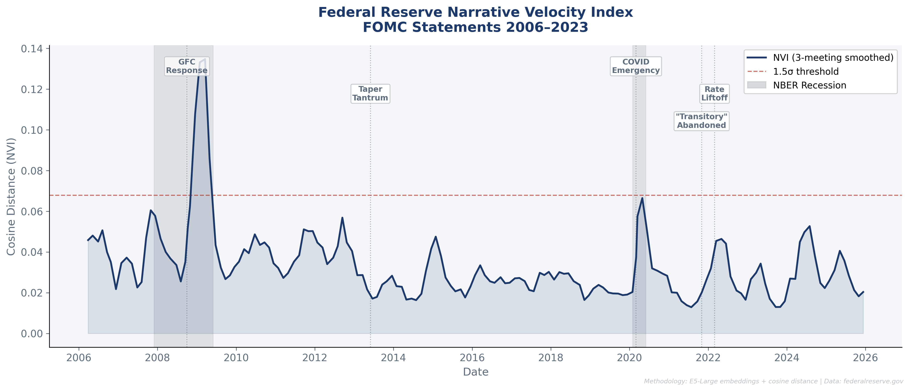
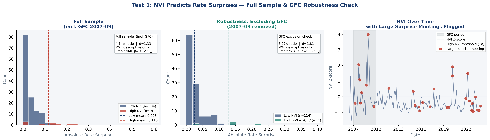
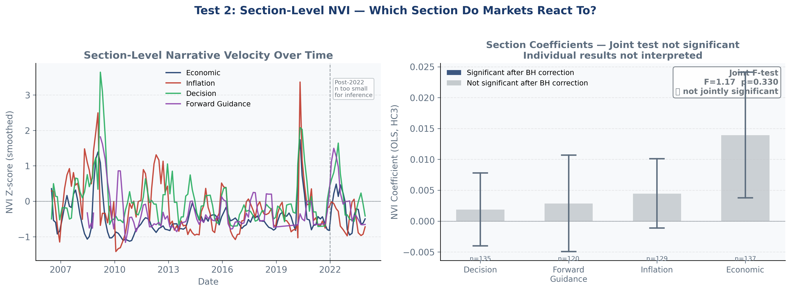
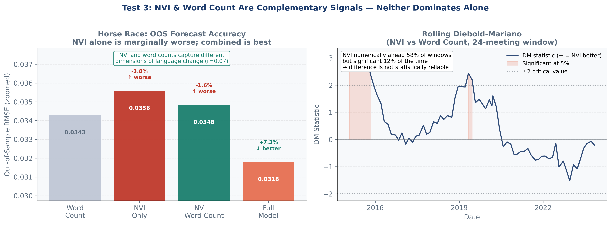

# Federal Reserve Narrative Velocity Index (NVI)

> Measuring how fast the Fed changes its mind — before the rate decisions confirm it.

The Fed raised rates 525 bps in 18 months. The words came first. Central banks don't pivot overnight — the language shifts gradually, meeting by meeting, before the decisions follow. This project measures the speed of that shift using semantic embeddings.

**The idea:** it's not what they say. It's how fast the language is changing.

---

## What is the NVI?

The Narrative Velocity Index is the cosine distance between consecutive FOMC statement embeddings. A high NVI means the Fed is rewriting its language fast — which historically coincides with regime-change episodes like the GFC response, the "transitory" U-turn, and the 2022 rate liftoff.

Unlike hawk-dove tone scores, NVI captures *change*, not level. A consistently hawkish Fed scores low on NVI; a Fed mid-pivot scores high.

---

## Methodology

### Data
- **Corpus:** 150+ FOMC press statements scraped directly from federalreserve.gov (2006–2025)
- **Policy surprises:** Bauer-Swanson (2023) high-frequency monetary policy surprise data, matched to FOMC dates
- **Macro controls:** FRED — fed funds rate (DFF), CPI (CPIAUCSL), unemployment (UNRATE)

### NVI Construction
1. Each statement embedded using `intfloat/e5-large-v2` (E5-Large)
2. Cosine distance computed between consecutive meeting embeddings → raw NVI
3. Z-scored using a strict **expanding window** (no look-ahead bias): at time *t*, only data from meetings 0..t are used
4. 3-meeting rolling mean applied for smoothing

### Section Splitting
Statements are split into four sections using a regex + positional sentence-boundary classifier:
- **Decision** — rate action language
- **Forward guidance** — committee expectations and conditionality
- **Inflation** — price stability and CPI references
- **Economic** — activity, labour market, spending

Each section gets its own NVI series, enabling granular analysis of which part of the statement is changing fastest.

### Hawk-Dove Tone Benchmark
Tone scored using the Loughran-McDonald finance dictionary, supplemented with Fed-specific terms (e.g. *accommodative*, *restrictive*, *transitory*). Expanding z-score applied for comparability with NVI.

---

## Results

### Test 1 — Does NVI predict rate surprises?

High-NVI meetings had 4.1× larger raw surprises (Cohen's d = 1.33). But the Probit average marginal effect was **not significant** after controlling for inflation gap and unemployment (p = 0.127). The GFC drove most of the raw effect — excluding 2007–09, the ratio rises to 5.3× but the Probit remains insignificant (p = 0.226).

> **Conclusion:** NVI does not independently predict surprise size after macro controls. The raw descriptive difference reflects regime-change episodes coinciding with high-NVI readings, not a conditional signal.

### Test 2 — Which section moves markets most?

Section-level NVIs (decision, forward guidance, inflation, economic) tested jointly against winsorized absolute surprise size with HC3 standard errors.

Joint F-test: **F = 1.17, p = 0.33** — sections do not jointly predict surprise size. Individual section follow-up tests not run.

> **Conclusion:** No single section of the FOMC statement carries a reliable, exploitable signal in isolation.

### Test 3 — Can NVI beat a simple hawk-dove word count?

OOS horse race (train: 2006–2018, test: 2019–2023):

| Model | OOS RMSE | vs Baseline |
|---|---|---|
| Word count only | 0.0343 | — (baseline) |
| NVI only | 0.0356 | +3.8% worse |
| NVI + Word count | 0.0348 | marginally better |
| Full model (+ macro) | 0.0318 | +7.3% better |

NVI alone lost. But NVI and word counts have r = 0.07 — they're measuring orthogonal things. Combined with macro controls, the full model improves OOS accuracy by 7.3%. Diebold-Mariano test: **DM stat significant in ~12% of rolling windows** — the difference is not statistically reliable across the full period.

> **Conclusion:** Velocity and tone are complements, not substitutes. Neither dominates alone.

---

## Figures

**Fig 1 — NVI Time Series (2006–2025)**

The NVI spikes around the GFC response, COVID emergency, and 2022 liftoff — the three largest Fed regime changes in the sample.



**Fig 2 — Test 1: NVI vs Rate Surprises**



**Fig 3 — Test 2: Section-Level NVI**



**Fig 4 — Test 3: Horse Race & Rolling Diebold-Mariano**



---

## Requirements

```bash
pip install sentence-transformers requests beautifulsoup4 pandas fredapi \
            scipy matplotlib statsmodels pandas-datareader
```

External data required:
- **Bauer-Swanson (2023) surprises:** available at [AEA data repository](https://www.aeaweb.org/articles?id=10.1257/aer.20230038) 
- **Loughran-McDonald dictionary:** available at [loughranmcdonald.com](https://sraf.nd.edu/loughranmcdonald-master-dictionary/)
- **FRED API key:** free at [fred.stlouisfed.org](https://fred.stlouisfed.org/docs/api/api_key.html) — set in Block 6

---

## Limitations

- Sample is FOMC press statements only — minutes, speeches, and press conferences are excluded
- Section splitter is rule-based; recall is imperfect on pre-2010 statements with non-standard formatting
- BSW surprises cover scheduled meetings only; inter-meeting actions are unmatched
- Post-2022 section has limited observations for inference
